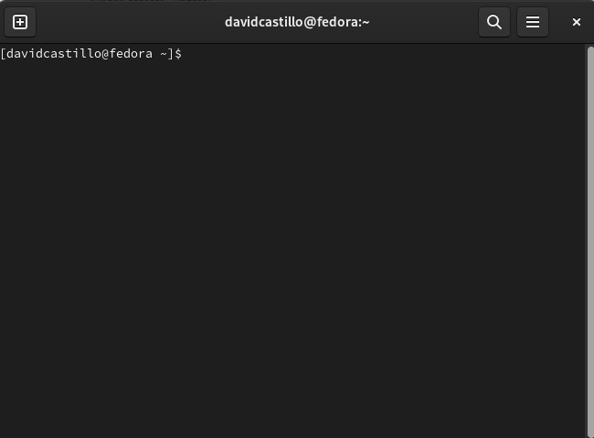
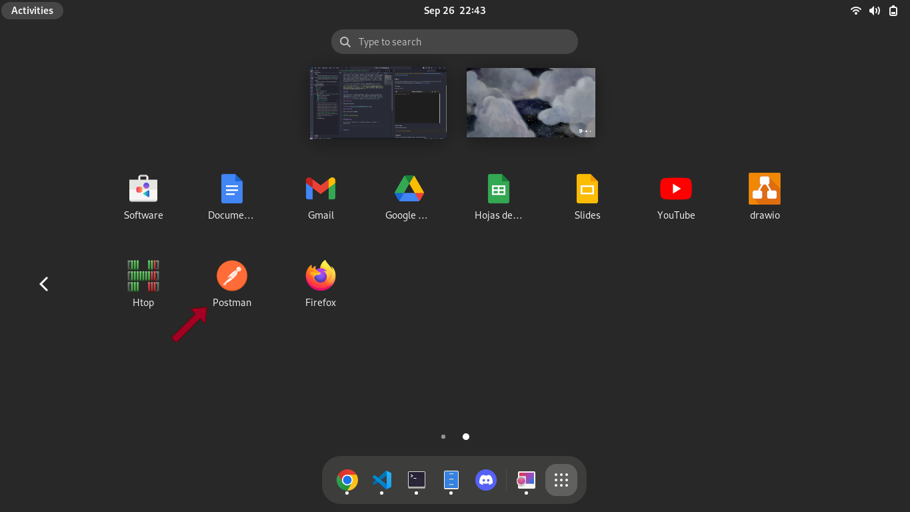
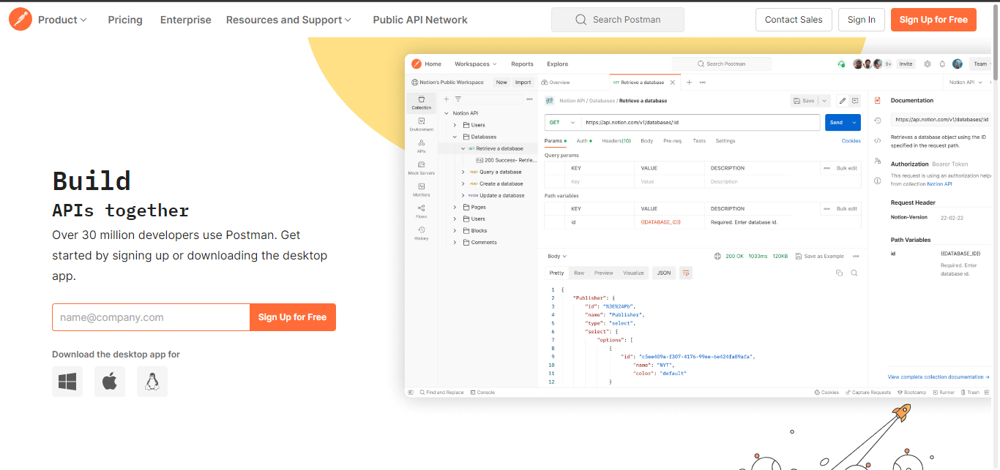
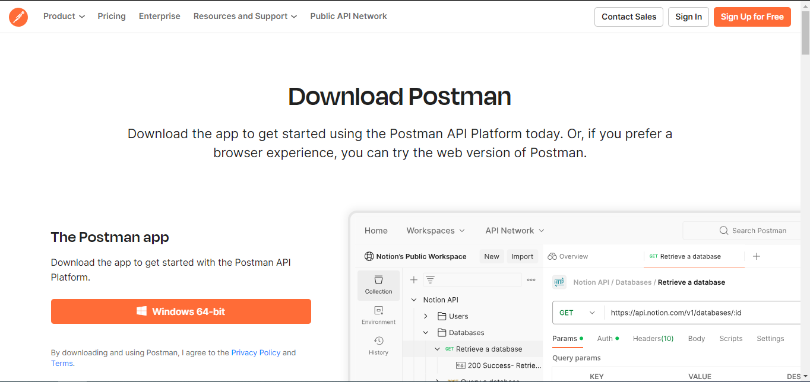
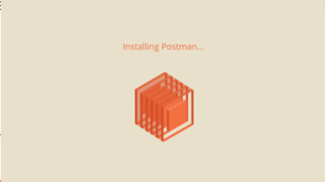

## What is Postman

Postman is an API(application programming interface) development tool which helps to build, test and modify APIs. Almost any functionality that could be needed by any developer is encapsulated in this tool. It is used by over 5 million developers every month to make their API development easy and simple. It has the ability to make various types of HTTP requests(GET, POST, PUT, PATCH), saving environments for later use, converting the API to code for various languages(like JavaScript, Python).

>[!note]
>For more information about Postman visit the following links <a href="https://www.postman.com/product/what-is-postman/">Postman oficial site</a> and <a href="https://www.geeksforgeeks.org/introduction-postman-api-development/">Geeks for Geeks: Introduction to Postman for API Development</a>.


## Linux

The easiest way to install postman in Linux is using [Snap](https://snapcraft.io/). If your Linux distribution does not come with Snap installed as standard, visit the following link for more information [Snap installation](https://snapcraft.io/docs/installing-snapd).

### First Step

Open your terminal:



### Second Step

Execute the next command.

```bash
sudo snap install postman
```

### Third Step

Once you have finished the installation process, execute the application.



>[!note]
>The graphical interface may vary depending on the graphical environment of your distribution

### Fourth step

You will see a login page, you can create an account, login in if you already have one, or skip it if you don't want to register.

After all this steps you are ready to use postman.

## Windows

The process from install Postman in windows is easy, the main and more common process is download .exe file in [the official postman web page.](https://www.postman.com/)

### First Step

Visit the official web site of postman:



### Second Step

In the "Download the desktop application for" field, select the Windows option, then a new page where we can find the "Windows 64-bit" button, then you need to press the button and it will automatically start downloading the installation file for windows.



>[!note]
>The downloaded installation file is compatible with Windows 64-bit architecture on the processor, so it is necessary to verify before that your device is compatible with the downloaded postman installer.

### Third Step
Finally, you must run the .exe installation file, where an indication that Postman is being installed on your Windows device will appear, leaving the application ready for normal execution locally.

