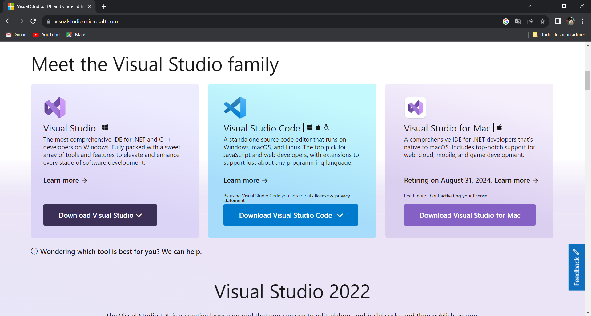
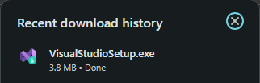
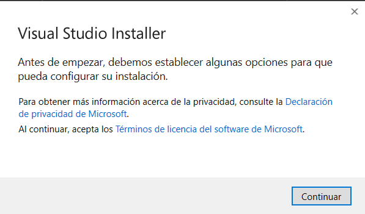
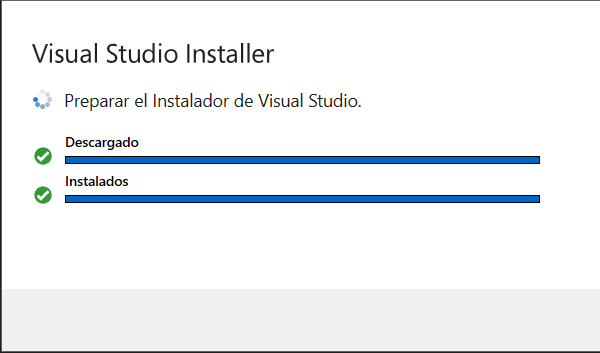
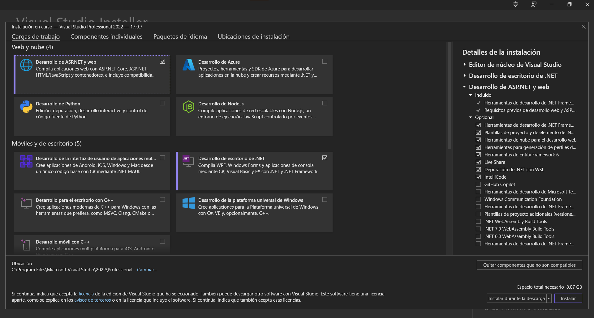
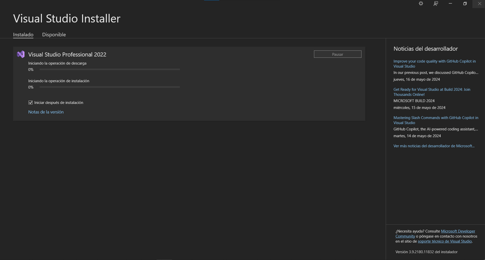
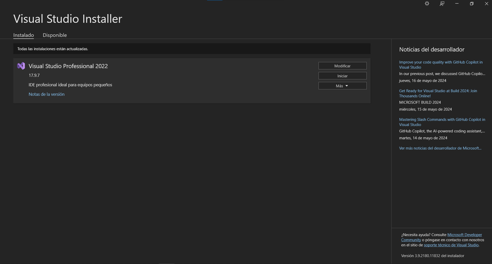

# Install Visual Studio Community Version IDE

## First step 
To install the .Net SDK on Windows (Valid for Windows 10 and Windows 11) it is good to note that its installation is easier compared to Linux environments, the first thing is to search in your browser with an internet connection and, of your preference, the "Visual Studio Community" code editor by entering the official Microsoft website, or you can also access the official site at the following link:  
[Visual Studio Community Download Link](https://visualstudio.microsoft.com/)

At the bottom, select the community version of Visual Studio for Windows on the left side of the screen.

>[!note]
>It is possible that Microsoft will update the design of the download website, the important thing is to find and download the Visual Studio Community for Windows.

## Second Step
After selecting the version of visual studio community, the VisualStudioSetup.exe installer will be automatically downloaded to your device:

>[!note]
>The downloaded file may vary in name due to possible Microsoft modifications, please verify that the download is made from the official Microsoft site <a href="https://visualstudio.microsoft.com/es/thank-you-downloading-visual-studio/?sku=Professional&channel=Release&version=VS2022&source=VSLandingPage&cid=2030&passive=false">Here you can download the official version of Visual Studio Community</a>.

With the installer downloaded we proceed to execute to begin the installation with the IDE, when clicking on the installer, the execution of the program will begin, so the following text box will appear in which we must click on the "Continue" button

The system will begin a download to begin configuring the installer, prior to installing all the necessary components to be able to work in the IDE

When the installer is ready, a list will open with the different resources that can be used in the IDE to develop different applications. For the moment, the first option will be selected, "ASP.NET and web development." , to finish by clicking on the "Install" button

>[!note]
>To check the installation location of the IDE, at the bottom left of the installer, we can find the location where Visual Studio will be installed, if you want to change the installation path, it is possible to perform this action by clicking on the "Change" button " next to the current installation path.

## Third step
Next, start the installation process of the resources selected in the previous installation step, the download and installation operation may take a few minutes

Finally, and after completing the download and installation process, the IDE will automatically start. When this happens, it means that the .Net SDK and Visual Studio Community are correctly installed and ready for use.

