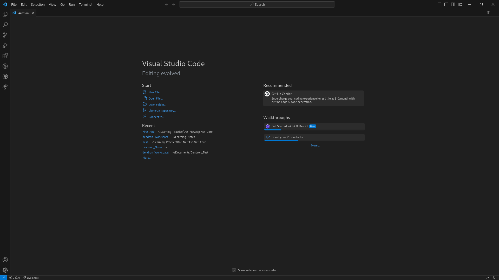
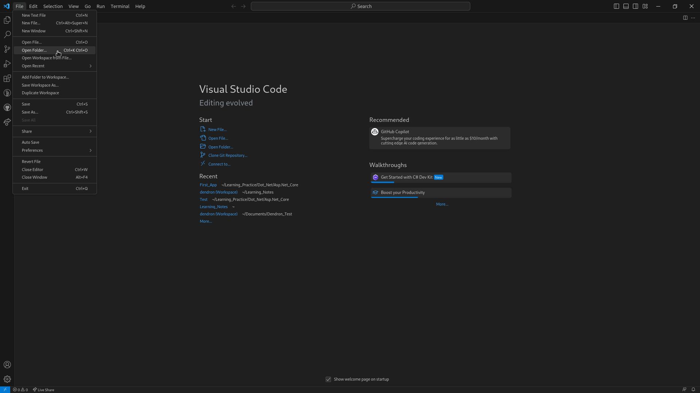
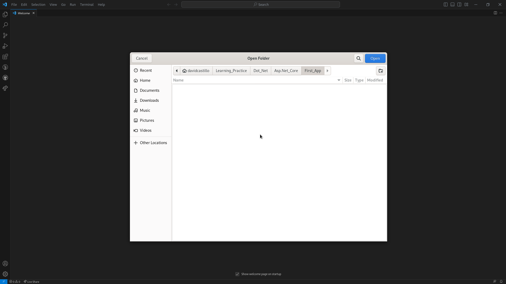
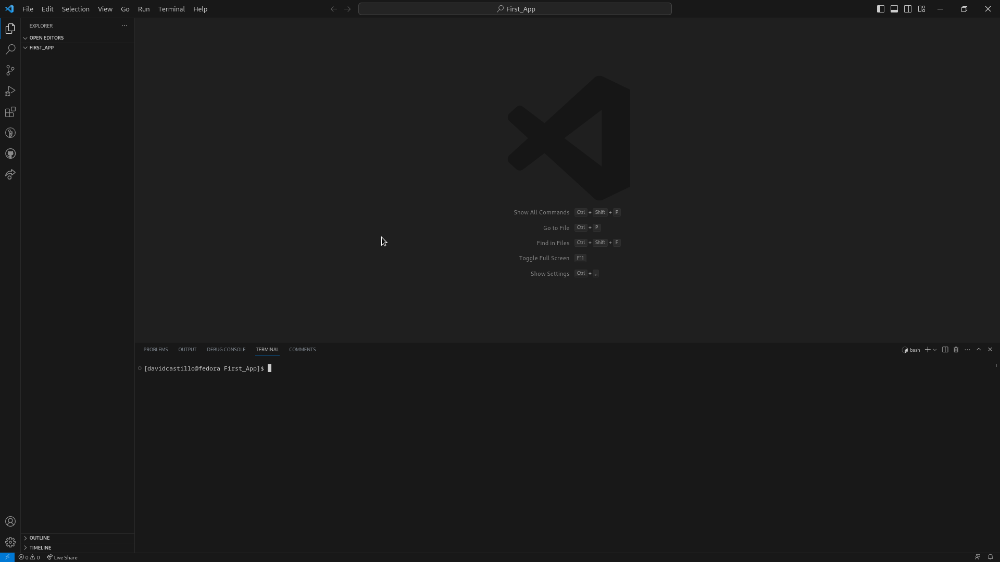
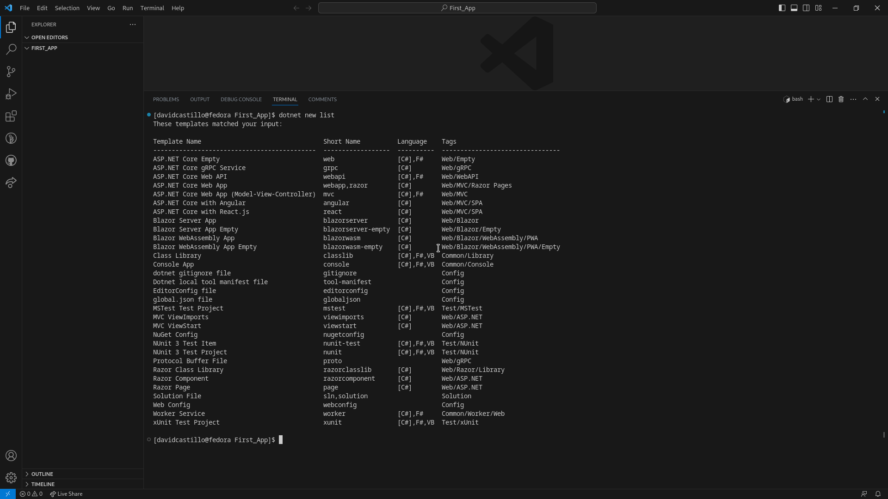
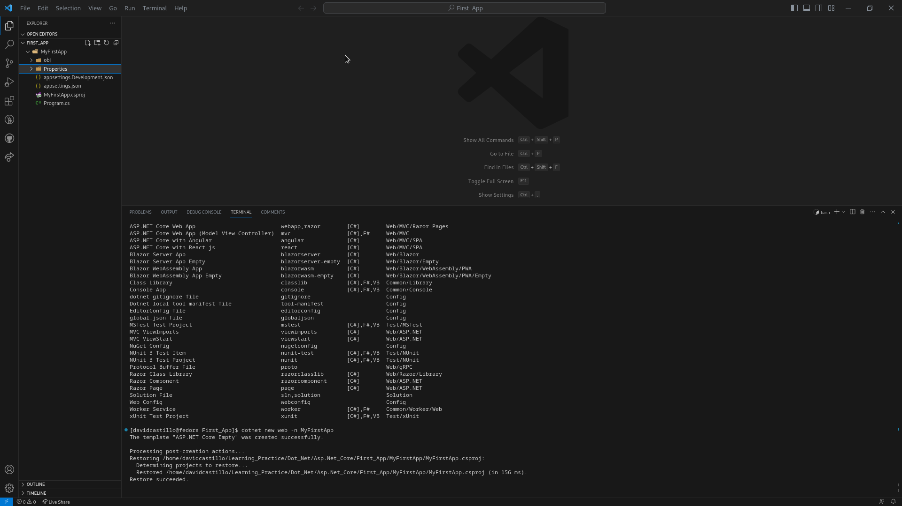
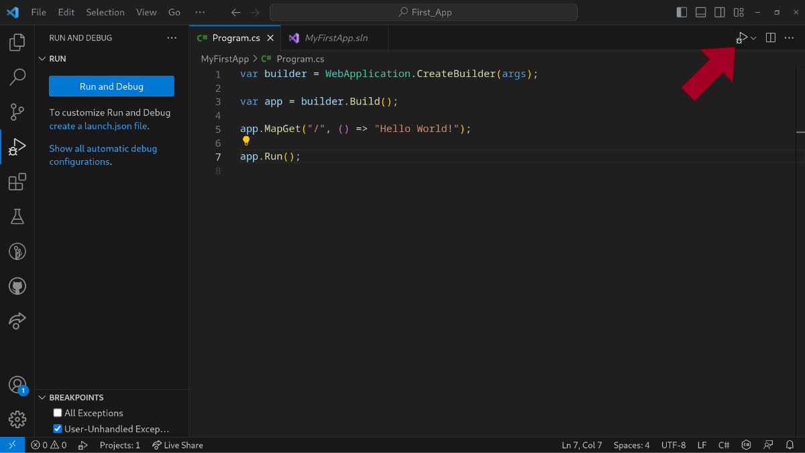

## Open VS code.



## Once it's open, go to files and click on open folder, or use the key board shortcut "Ctrl+k Ctrl+o".



## You will see a pop up menu, choose where you are goin to generate the project, and click open.



## Open a terminal.



## Execute the next command

```bash
dotnet new list
```

Once the command is executed you will see a list with all the project templates for .Net.



<p style="color:yellow">Note: When you are creating a project from CLI try always to remember the short name of the template that you want to create to use it in the next command.</p>

## Execute the next command

```bash
dotnet new web -n MyFirstApp
```

Once it is executed you will se that a folder was created.



## Try to execute your app

To do this you have 2 options

If you have the extensions installed click the button that points the red arrow, as shown in the next image.



You can also run your app runing the next command in the terminal

```bash
dotnet run
```

<p style="color:yellow">
Note: The terminal must be in the directory where your project is, otherwise you will have to indicate with the <code>--Project</code> flag where is the project that you want to run by passing the path of where it is located.
</p>

If you want to see the example project you can visit this repo: [My First App](https://github.com/CASDAV/DotNet.Code/tree/main/MyFirstApp)

## Next Steps
- [[LaunchSettings]]