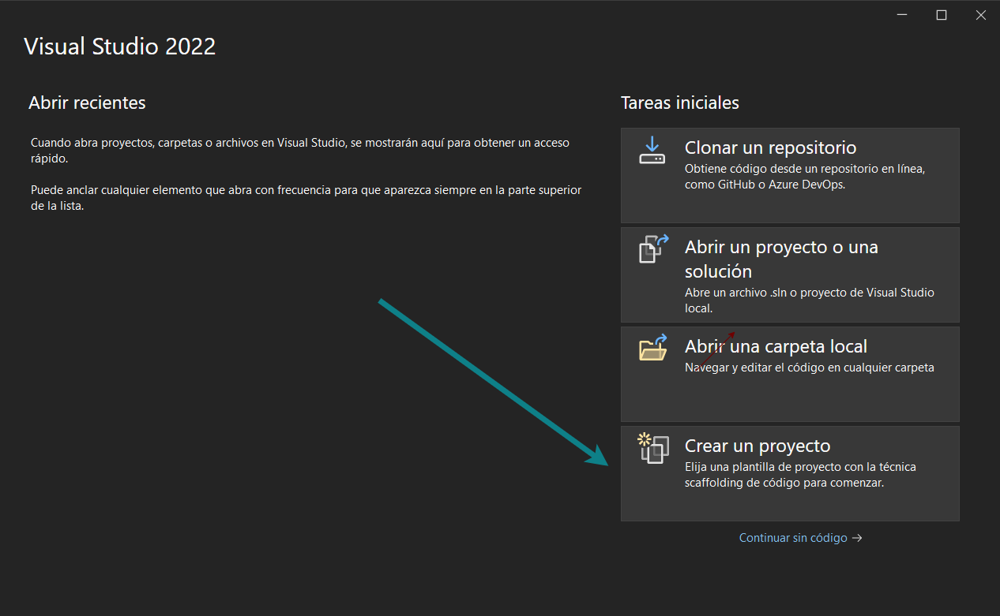
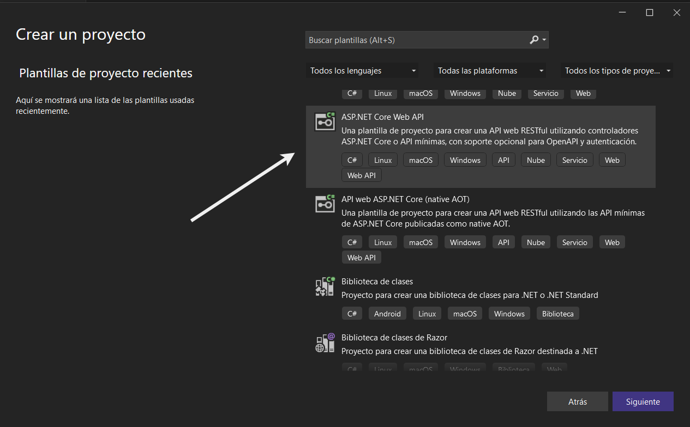
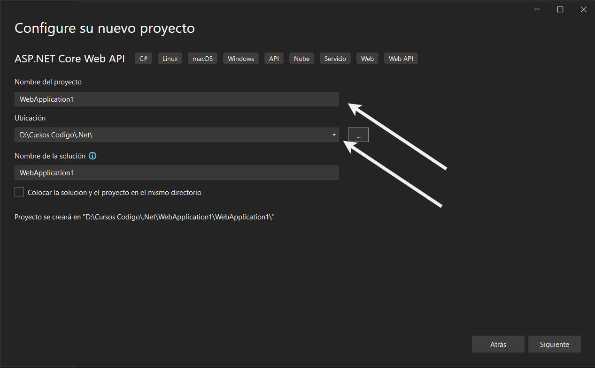
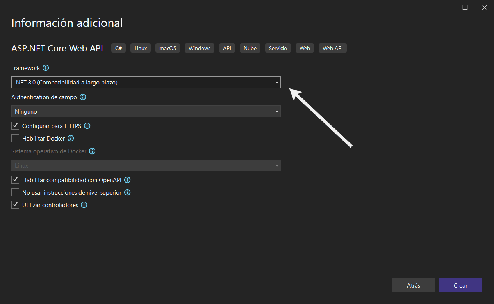

## Launch Visual Studio 2022 IDE and select Create New Project

Note: On the screen you can select different options in addition to creating a project from scratch, such as cloning an existing repository on a platform, it also gives us the possibility of opening an existing project.

## Select one of the templates for your project (For the first project the ASP .NET Core Web API template is used)

## Give the project a name and a location on the designated path

