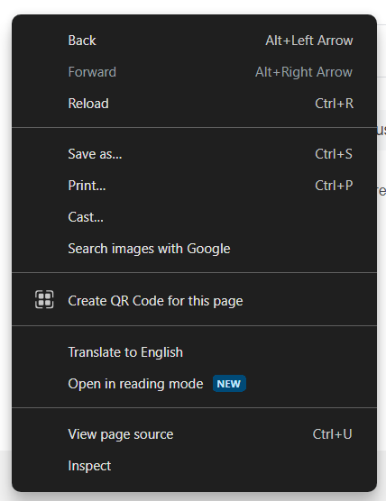
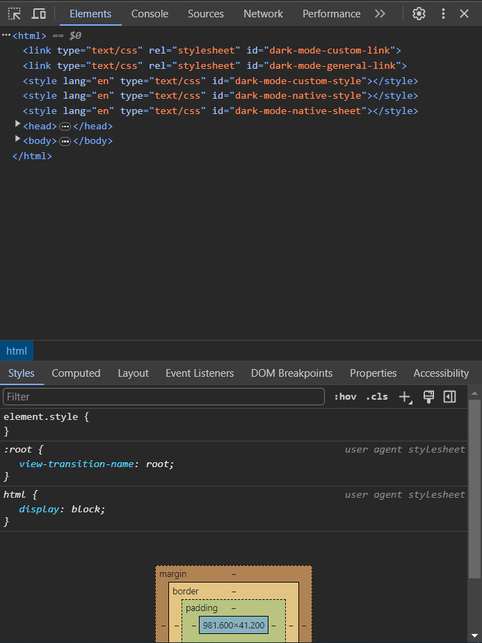
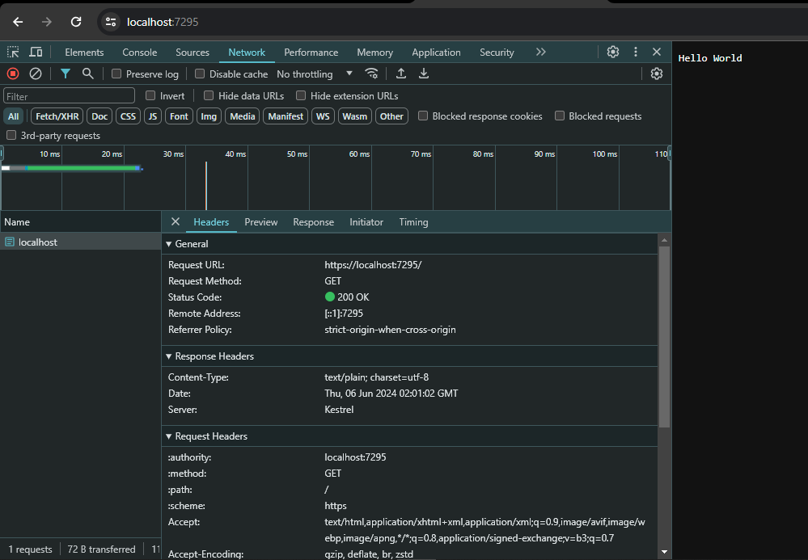

%% Te tienes que encargar de eso gordito %%

## Use Developer Options in Navigator

To view HTTP requests in your browser, it is essential to access the development tools built into the browser you prefer to use. Before continuing, it is important to note that all modern browsers have similar development tools that allow you to perform web page inspection and debugging tasks. However, in this case we will focus on explaining the process using the Google Chrome browser, given its great popularity and set of development tools.

Accessing the developer tools gives you a window into your browser's internal "engine," allowing you to inspect, modify, and debug a web page's code in real time. This is crucial for understanding how different elements on a page interact and for identifying potential problems, including those related to HTTP requests.

Normally, to access the browser development tools, all you have to do is right-click anywhere on the web page. In this way, a menu of options will appear where we can select the "Inspect" option, which will allow us to access your browser's developer tools.




>[!note]
>The instructions and images presented correspond to the process of viewing the developer options in Google Chrome, however, the steps in other commercial browsers are very similar to those presented previously in this section.

Importantly, these development tools not only allow you to view HTTP requests, but also analyze their contents, inspect request and response headers, and much more. This gives you deep insight into the inner workings of a website and helps you resolve issues related to network traffic.

Exploring and becoming familiar with development tools is an invaluable skill for any web developer, regardless of which browser they use.



## HTTP Request

Now, based on the information presented above in [[Understanding HTTP]], we have different methods used in resource management. For this case, we are going to take into account how we can interact with these resources using the **Development Tools** mentioned above
### GET Method
As mentioned before, this method allows us to access a specific resource, so in this case we are going to access a resource through GET and using URLs, so we need a project to access a resource, For this case, we will access a text string with "Hello World!"

```csharp
var builder = WebApplication.CreateBuilder(args);
var app = builder.Build();

app.MapGet("/", () => "Hello World");

app.Run();
```

Now, when executing the code and taking into account that the project URL is the address determined in the project settings (in this case, it is `localhost:7295`), we can access the content from our browser.

To do this, simply open your preferred browser and enter the URL `https://localhost:7295`. This will send a GET request to the server, which will respond with the content specified in our code, in this case, the message "Hello World."

>[!note]
>To find out the URL of your project, you must go to its root and access the Properties folder. Inside this folder, you will find a file called launchSettings.json, which contains the configuration parameters for your project. It is in this file where you should look for the "applicationUrl" field to find out the address (or addresses) of your project. 

When executed in the browser, we can see that the "Hello World" present in the code is presented, so now, if we access the developer tools, in the "Network" tab and reload the page, we can see the request What we have just done to the server, with additional properties, if we click on the request, we can see in detail more information about the GET request made


In the request, we can see some fields that are related to what is presented in [[Understanding HTTP]]. Next, we are going to present the most relevant ones of this request:

1. **General:**
	 - **Request URL**: This is the URL to which we make the request.
	 - **Request Method**: Type of request we make. In this case, the request type is GET.
	 - **Status Code**: Code that refers to the status of the request we made. In this case it is 200. For more information on the codes, see the following link: [HTTP response status codes](https://developer.mozilla.org/en-US/docs/Web/HTTP/Status).
	 - **Remote Address**: IP address of the server to which the request was sent.
	 - **Referrer Policy**: Referrer policy that controls what referrer information is included with the request.
2. **Response Headers:**
	 - **Content-Type**: Type of content sent in the response.
	 - **Date**: Date the response was sent.
	 - **Server**: Information about the server that sends the response.
3. **Request Headers:**
	 - **authority**: Authority of the requested resource.
	 - **method**: Request method used.
	 - **path**: Path of the requested resource.
	 - **schemes**: URI schemes supported by the client.
### POST Method
### PUT Method
### DELETE Method
