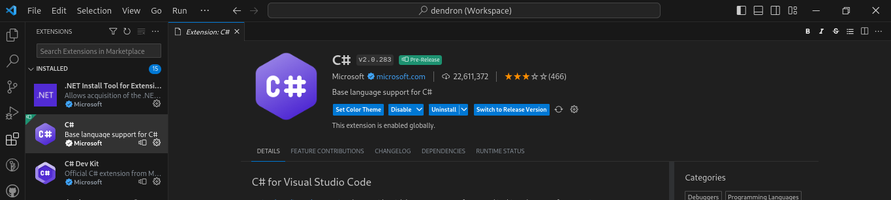

### Install Visual Studio Community Version IDE

The first step to install the .Net SDK on Windows (Valid for Window 10 and Windows 11) is easier compared to Linux, first search in the browser with an internet connection and, of your preference, search for the code editor in the browser as you can see below:

```bash
https://visualstudio.microsoft.com/
```
At the bottom, select the visual studio on the left side of the screen


## Install .Net Extension for Visual Studio Code

The step is similar to linux set up, it is necessary install Visual Studio Code IDE in windows, the IDE  can you download below:

```bash
https://https://code.visualstudio.com/
```

After IDE has installed, search in extension Browser <p style="color:yellow">.Net Extension for Visual Studio Code</p> Can you see the extension in the next image

